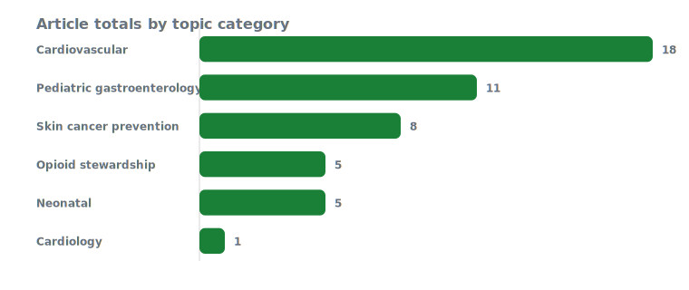
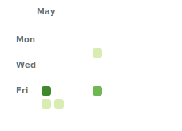

# Ehvidence

[](https://github.com/robbie-med/Ehvidence/actions/workflows/deploy.yml)
[](https://github.com/robbie-med/Ehvidence/actions/workflows/deploy.yml)
[](LICENSE)
[]
[]
[]

A static site that turns structured clinical evidence into topic pages with computed pooled metrics.

Each topic page is built from a JSON definition of intervention, comparator, outcomes, and study data, with automatically computed pooled estimates, confidence intervals, number needed to treat/harm, and study-level details.

## Table of Contents

- [Why Ehvidence](#why-ehvidence)
- [Features](#features)
- [How it works](#how-it-works)
- [Quick Start](#quick-start)
- [Adding a Topic](#adding-a-topic)
- [Project Structure](#project-structure)
- [Testing](#testing)
- [Deploy](#deploy)
- [Contributing](#contributing)
- [License](#license)

## Why Ehvidence

Ehvidence is designed for transparent evidence review with a data-first workflow:

- Topics are authored as JSON and validated at build time.
- The same computation code powers both the rendered site and the data-entry GUI.
- Topic pages are generated from the underlying studies, not from hand-written summaries.
- The site is a static Astro build, making it fast, portable, and easy to deploy.

## Features

- Topic dashboard with counts of topics, studies, and patients
- Topic scatter plot and sortable ranking table
- Study-level forest plots and outcome detail tabs
- Computed metrics: RR, 95% CI, pooled effect, NNT/NNH, and evidence status
- Data-entry GUI for validating topic JSON and exporting structured topic files
- Build-time data validation using Zod

## Current coverage

Automatically generated from `src/content/topics/*.json` and refreshed daily by GitHub Actions.





<!-- TOPICS-COVERAGE:START -->

**Topics covered:** 13
**Articles covered:** 48
**Total patients analyzed:** 244,393

| Topic | Articles | Patients | Category |
| --- | ---: | ---: | --- |
| Beta-carotene for skin cancer prevention | 1 | 1,805 | Skin cancer prevention |
| Celecoxib for skin cancer prevention | 1 | 240 | Skin cancer prevention |
| CoQ10 in Chronic Heart Failure (Q-SYMBIO) | 1 | 420 | Cardiology |
| Nicotinamide for skin cancer prevention | 1 | 386 | Skin cancer prevention |
| Omega-3 (fish oil) for cardiovascular events | 7 | 93,805 | Cardiovascular |
| Oral / subcutaneous vs intravenous opioids | 5 | 33,973 | Opioid stewardship |
| Oral retinol for skin cancer prevention | 1 | 2,297 | Skin cancer prevention |
| S. boulardii for pediatric acute diarrhea (China) | 11 | 1,749 | Pediatric gastroenterology |
| Statins for primary prevention | 7 | 61,844 | Cardiovascular |
| Statins for secondary prevention | 4 | 38,153 | Cardiovascular |
| Sunscreen for skin cancer prevention | 3 | 4,863 | Skin cancer prevention |
| Topical 5-fluorouracil for skin cancer prevention | 1 | 932 | Skin cancer prevention |
| Vitamin K prophylaxis for newborns | 5 | 3,926 | Neonatal |
<!-- TOPICS-COVERAGE:END -->

## Tech stack

- Astro static site generator
- Preact for interactive data-entry UI
- Zod for schema validation
- GitHub Actions for build, test, and Pages deployment
- JSON-first content model for clinical topics

## How it works

- **Content**: one topic JSON file per clinical topic lives in `src/content/topics/`.
- **Topic model**: each file describes an intervention, comparator, outcomes, and the studies that measured those outcomes.
- **Validation**: `src/content/config.ts` defines the topic schema and validates each JSON file at build time.
- **Computation**: `src/lib/stats.ts` computes effect sizes, confidence intervals, NNT/NNH, and random-effects pooling.
- **Rendering**: `src/pages/topics/[slug].astro` and `src/pages/index.astro` generate the site from topic data.
- **Data-entry GUI**: `src/islands/DataEntryApp.tsx` provides an interactive form for building topic JSON from study data.

## Quick Start

```bash
npm install
npm run dev
```

Open the local dev server and browse the site.

### Build for production

```bash
npm run build
```

### Preview the production build

```bash
npm run preview
```

## Adding a Topic

1. Open the contribution UI at `/contribute`.
2. Enter the topic metadata, outcomes, and study records.
3. Export the validated JSON.
4. Save the exported file as `src/content/topics/<slug>.json`.

Topics are automatically picked up by Astro and validated at build time. Invalid JSON or schema violations will fail the build.

> Tip: You can also author JSON manually. Use an existing topic file such as `src/content/topics/vitamin-k-vkdb.json` as a template.

## Project Structure

- `src/pages/` — Astro page routes (`index.astro`, topic pages, compare pages, contribute page)
- `src/layouts/` — common page layout components (`BaseLayout.astro`, `TopicLayout.astro`)
- `src/components/` — reusable visual components and tables
- `src/content/` — topic collection schema and topic JSON content
- `src/lib/` — computation and presentation logic (`stats.ts`, `derive.ts`, `compare.ts`, `format.ts`)
- `src/islands/` — client-side interactive data-entry UI
- `src/styles/` — global stylesheet

## Testing

Run the unit tests for the statistics engine:

```bash
npm run test
```

The test suite includes validation of effect-size calculations and pooled estimate behavior.

## Deploy

This repository is configured as a static Astro site.

If using GitHub Pages or another static host, build the site with `npm run build` and publish the generated `dist/` output.

## Contributing

Contributions are welcome.

- Add or improve topic content by creating JSON files under `src/content/topics/`.
- Fix layout, accessibility, or usability in `src/components/` and `src/layouts/`.
- Improve the statistics engine in `src/lib/stats.ts`.

When adding a topic, include source citations and methodology notes to keep the evidence record transparent.

## License

MIT License © 2026 robbie.med
